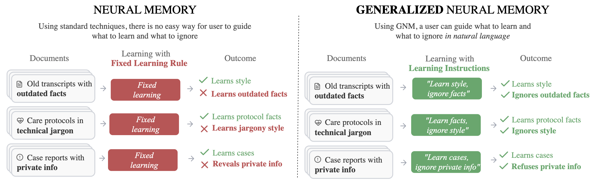

# Generalized Neural Memory
This is the official implementation of paper **"Tell Me What To Learn: Generalizing Neural Memory to be Controllable in Natural Language"** by Max S. Bennett, Thomas Zollo, Richard Zemel.

This work extends neural memory systems to support controllable, instruction-guided memory updates. We build upon the MemoryLLM architecture and introduce mechanisms for selective fact memorization and refusal based on natural language instructions.

<p align="center" width="100%">
<!-- put the image "memoryllm.png" -->

</p>


## Official Links
[](https://arxiv.org/abs/2402.04624)

[](https://huggingface.co/maxbennett/generalized-neural-memory-gnm-all)
[](https://huggingface.co/maxbennett/generalized-neural-memory-icl-all)
[](https://huggingface.co/maxbennett/generalized-neural-memory-rag-all)
[](https://huggingface.co/maxbennett/generalized-neural-memory-gnm-all-ablation)
[](https://huggingface.co/maxbennett/generalized-neural-memory-gnm-facts)
[](https://huggingface.co/maxbennett/generalized-neural-memory-icl-facts)
[](https://huggingface.co/maxbennett/generalized-neural-memory-rag-facts)

[](https://huggingface.co/datasets/maxbennett/counterfact-gnm)


## Getting Setup

### Step #1: Setup Environment 

1. Clone the repository:
   ```bash
   git clone <repository-url>
   cd generalized_neural_memory
   ```

2. Create a conda environment:
   ```bash
   conda create -n gnm python=3.10
   conda activate gnm
   ```

3. Install dependencies:
   ```bash
   pip install -r requirements.txt
   ```

### Step #2: Download Data
Our synthetic dataset is available on Hugging Face: [maxbennett/counterfact-gnm](https://huggingface.co/datasets/maxbennett/counterfact-gnm)

Download the data into `data/counterfact_gnm/` using the Hugging Face CLI:
```bash
hf download maxbennett/counterfact-gnm --repo-type dataset --local-dir data/counterfact_gnm
```

### Step #3: Download Models
To reproduce evaluation results without retraining, download and convert our pre-trained models:

```bash
python download_models.py
```

This downloads all models from Hugging Face and converts them to `.pth` format for compatibility with the evaluation scripts.


## Reproducing Experiments

All experiments are managed using [DVC](https://dvc.org/) pipelines. To reproduce any experiment:

1. Navigate to the appropriate experiment directory
2. Run `dvc repro`

Each experiment directory contains:
- `params.yaml`: Hyperparameters and configuration settings
- `dvc.yaml`: Pipeline stage definitions
- `scripts/`: Experiment-specific scripts

Key configuration options in `params.yaml`:
- `distributed.cuda_visible_devices`: GPU devices to use
- `distributed.nproc_per_node`: Number of processes for distributed training
- `loop.sequence_length`: Number of documents per memory update sequence
- `sampling.*`: IO pair sampling configuration
- `opt.*`: Optimizer settings


### Reproducing Training

**Experiment 1 Training (Continual Learning of Targeted Facts):**
```bash
# GNM (our method)
cd experiments/train_exp1_gnm
dvc repro

# ICL baseline
cd experiments/train_exp1_icl
dvc repro

# RAG baseline
cd experiments/train_exp1_rag
dvc repro
```

**Experiment 2 Training (Continual Learning of Knowledge, Styles, and Behaviors):**
```bash
# GNM (our method)
cd experiments/train_exp2_gnm
dvc repro

# Ablation
cd experiments/train_exp2_gnm_ablation
dvc repro

# Baselines
cd experiments/train_exp2_icl
dvc repro

cd experiments/train_exp2_rag
dvc repro
```

### Reproducing Evaluation

```bash
# Experiment 1 evaluation (continual learning of targeted facts)
cd experiments/eval_exp1
dvc repro

# Experiment 2 evaluation (continual learning of knowledge, style, and behaviors)
cd experiments/eval_exp2
dvc repro

# Experiment 3 evaluation (compositional generalization)
cd experiments/eval_exp3
dvc repro
```

## Reproducing Our Synthetic Dataset

To reproduce the our synthetic dataset, follow the below procedures. 

1. first download CounterFact dataset from hugging face, and place it into the directory `/data/raw/counterfact/`
2. then navigate to `data_pipelines/generate_categorized_counterfact_data_from_mapping` and run `dvc repro` to produce a categorized version of counterfact
3. move the now categorized files `train.json` and `test.json` from `data_pipelines/generate_categorized_counterfact_data_from_mapping/artifacts` to `data/counterfact_with_categories/`
3. then navigate to `data_pipelines/generate_documents` and run `dvc repro`.
4. the produced files should be the same or extremely similar to the data we used.


## Evaluation Results

Pre-computed evaluation results are available in `saved_evals/`. Each subdirectory contains results for different experimental conditions:
- `comp_gen_fact_refusals/`: Compositional generalization results
- `format_generalization/`: Format generalization results
- `mixed_documents/`: `Continual Learning of Knowledge, Styles, and Behaviors' evaluation
- `warmup/`: `Continual Learning of Targeted Facts' analysis

Jupyter notebooks in `notebooks/` reproduce all figures and analyses from the paper:

| Notebook | Description |
|----------|-------------|
| `ablation.ipynb` | Ablation study visualizations |
| `comp_gen.ipynb` | Compositional generalization analysis |
| `flops.ipynb` | Computational cost analysis |
| `format_generalization.ipynb` | Format generalization experiments |
| `memory_analysis.ipynb` | Memory analysis |
| `mixed_docs.ipynb` | `Continual Learning of Knowledge, Styles, and Behaviors' experiments |
| `mixed_docs_heatmaps.ipynb` | `Continual Learning of Knowledge, Styles, and Behaviors' Heatmap visualizations |
| `warmup_summary.ipynb` | `Continual Learning of Targeted Facts' experiment summary |
| `warmup_heatmaps.ipynb` | `Continual Learning of Targeted Facts' heatmap visualizations |


## Repository Structure

```
├── src/                          # Source code
│   ├── gnm.py                    # Main GNM model implementation
│   ├── gnm_data.py               # Data loading and processing
│   ├── instructions.py           # Instruction generation utilities
│   ├── memoryllm_train.py        # Training and validation functions
│   ├── config_memoryllm_train.py # Training and eval config schema
│   ├── modeling_memoryllm.py     # Slightly modified code from MemoryLLM codebase
│   └── MemoryLLM/                # Forked MemoryLLM codebase (from MemoryLLM code, cited below)
│   └── utils/                     # Utility scripts (metrics, plotting, constructors, etc.)
├── experiments/                  # Experiment configurations (DVC pipelines)
│   ├── train_exp1_gnm/           # Experiment 1: GNM training
│   ├── train_exp1_icl/           # Experiment 1: ICL baseline training
│   ├── train_exp1_rag/           # Experiment 1: RAG baseline training
│   ├── train_exp2_gnm/           # Experiment 2: GNM training
│   ├── train_exp2_gnm_ablation/  # Experiment 2: Ablation studies
│   ├── train_exp2_icl/           # Experiment 2: ICL baseline training
│   ├── train_exp2_rag/           # Experiment 2: RAG baseline training
│   ├── eval_exp1/                # Experiment 1: Evaluation
│   ├── eval_exp2/                # Experiment 2: Evaluation
│   ├── eval_exp2_train/          # Experiment 2: Training set evaluation (for format generalization)
│   ├── eval_exp2_val_id/         # Experiment 2: In-distribution validation (for format generalization)
│   └── eval_exp3/                # Experiment 3: Evaluation
├── data_pipelines/               # Data generation pipelines
│   ├── generate_categorized_counterfact_data_from_mapping/       # categorize counterfact dataset
│   └── generate_documents/       # Document generation
├── data/                         # data
│   ├── raw/                      # for importing counterfact data
│   ├── counterfact_with_categories/         # for categorizing counterfact
│   └── counterfact_gnm/          # for storing our synthetic dataset
├── models/.                      # Trained model checkpoints
├── saved_evals/                  # Saved evaluation results
├── notebooks/                    # Analysis and plotting notebooks
└── plots/                        # Generated figures
```


## Acknowledgments

If you want to cite our work:

```bibtex
@misc{gnm,
  author       = {Max S. Bennett and Tom Zollo and Richard Zemel},
  title        = {{Tell Me What To Learn}: Generalizing Neural Memory to be Controllable in Natural Language},
  booktitle    = {ArXiv},
  year         = {2026},
  url          = {https://arxiv.org}
}
```

This codebase builds upon [MemoryLLM](https://github.com/wangyu-ustc/MemoryLLM). We include a fork of their code in `src/MemoryLLM/` with modifications for our controllable memory mechanisms. For citing MemoryLLM:
```bibtex
@inproceedings{memoryllm,
  author       = {Yu Wang and Yifan Gao and Xiusi Chen and Haoming Jiang and 
                  Shiyang Li and Jingfeng Yang and Qingyu Yin and Zheng Li and 
                  Xian Li and Bing Yin and Jingbo Shang and Julian J. McAuley},
  title        = {{MemoryLLM}: Towards Self-Updatable Large Language Models},
  booktitle    = {International Conference on Machine Learning (ICML)},
  year         = {2024},
  url          = {https://openreview.net/forum?id=p0lKWzdikQ}
}
```

